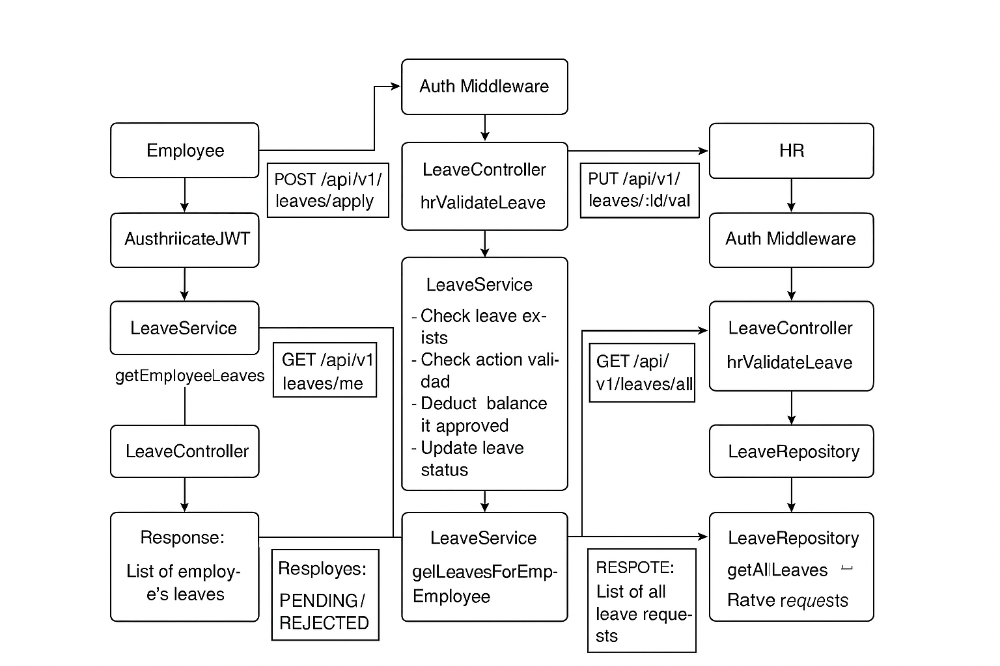
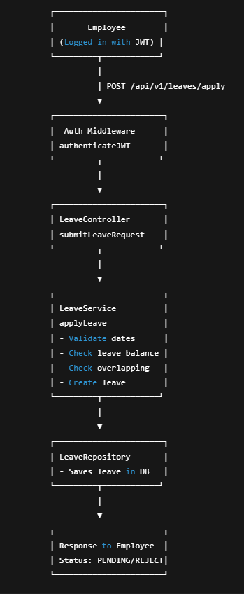
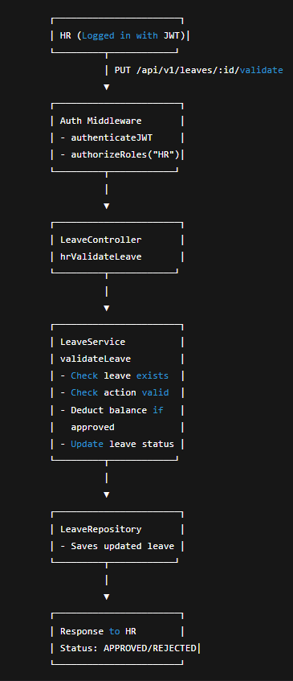
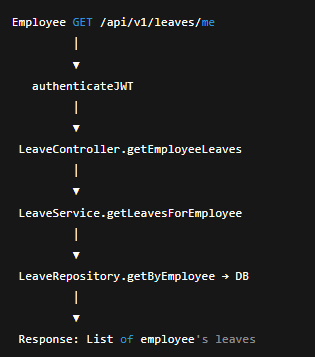
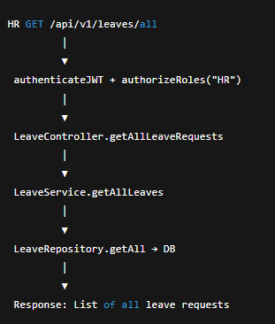

# 🚀 Leave Management System (Backend)

## 📌 Project Structure Overview

Inside the `src` folder resides all the actual source code for the project (excluding tests, which can be placed in a separate `test` folder):

- `config`  
  Contains configuration and setup for libraries or modules.  
  Example: Setting up `dotenv` for environment variables in `server-config.js`, configuring logging, etc.

- `routes`  
  Registers routes along with their corresponding middlewares and controllers.

- `middlewares`  
  Intercepts incoming requests for validation, authentication, and other pre-processing.

- `controllers`  
  Act as the last middleware, receiving requests and passing data to the business layer. They format the response after the business logic executes.

- `repositories`  
  Handles database interaction logic, including raw queries and ORM queries.

- `services`  
  Contains business logic and communicates with repositories to fetch or store data.

- `utils`  
  Helper functions, error classes, and other utility methods.

---

## ⚙️ Setup Instructions

1. Download this template from GitHub and open it in your favorite code editor.

2. Inside the project folder, install dependencies:
npm install

text

3. Create a `.env` file in the root directory with these environment variables:
PORT=<port number of your choice>

Node mailer email service
EMAIL_USER=<email_id_to_send_mails>
EMAIL_PASS=<email_password>

BCRYPT_SALT_ROUNDS=<salt_number>
JWT_SECRET=<super_secure_random_string>
JWT_EXPIRES=<expiry_time>

HR_EMAIL="hr@company.com"
HR_PASSWORD="Symplora-Hr@12345"

text

4. Database Configuration  
Inside the `src/config` folder, create a `config.json` file with this content (modify as per your setup):

{
"development": {
"username": "root",
"password": "mypassword",
"database": "database_development",
"host": "127.0.0.1",
"dialect": "mysql"
},
"test": {
"username": "root",
"password": null,
"database": "database_test",
"host": "127.0.0.1",
"dialect": "mysql"
},
"production": {
"username": "root",
"password": null,
"database": "database_production",
"host": "127.0.0.1",
"dialect": "mysql"
}
}

text

Alternatively, you can initialize Sequelize setup by running:
npx sequelize init

text
This creates `migrations`, `seeders`, and `config.js` inside the `src/config` folder.

5. Run migrations:
npx sequelize db:migrate

text

(Optional) Seed the initial HR user:
npx sequelize db:seed:all

text

6. To start the server in development mode:
npm run dev

text

---

## 🔑 API Endpoints

### Auth
- `POST /api/v1/auth/login` — Login (returns JWT)  
- `POST /api/v1/auth/change-password` — Change password

### Employees
- `POST /api/v1/employees` — Create employee (HR only)  
- `GET /api/v1/employees` — List employees (HR/Admin)  
- `GET /api/v1/employees/:id` — Get employee by ID  
- `PUT /api/v1/employees/:id` — Update employee (HR/Admin)  
- `DELETE /api/v1/employees/:id` — Delete employee (HR/Admin)  
- `GET /api/v1/employees/:id/leave-balance` — Get employee’s leave balance

### Leaves
- `POST /api/v1/leaves/apply` — Employee applies for leave  
- `GET /api/v1/leaves/me` — Employee views own leaves  
- `PUT /api/v1/leaves/:id/validate` — HR approves/rejects leave  
- `GET /api/v1/leaves/all` — HR views all leave requests

---

## 🛡️ Edge Cases Handled
- Leave applied before joining date  
- End date before start date  
- Requesting more days than available balance  
- Overlapping leave requests  
- Employee not found  
- Unauthorized role access

---

## 📈 Potential Improvements
- Multiple leave types (casual, sick, maternity, etc.)  
- Leave carry-forward to next year  
- Email/Slack notifications for leave approval  
- Employee & HR dashboards (frontend)  
- CI/CD pipeline with automated tests

---

## 🖼️ Visuals

  
  
  
  

---